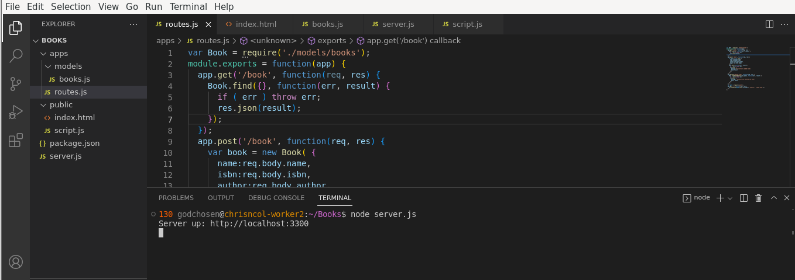
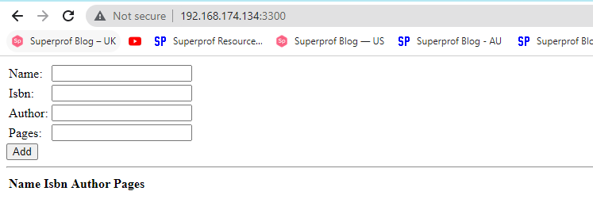

## MEAN STACK IMPLEMENTATION
To ensure a successful completion of this project, here are some prerequisites:
- Have VS Code and some of it's extensions installed.
- Install VMware and create an Ubuntu (v22.04) linux virtual machine 
- Create a GitHub account and create a personal access token (PAT)
- Create OpenSSH key pair in your local system and use the public key to create SSH key in GitHub

Below are the steps I followed to implement a MEAN STACK for a simple Book Register web form.

### 1.  Install NodeJs
I followed the steps below to configure the backend

- Update ubuntu
```
sudo apt update -y
```

- Upgrade ubuntu
```
sudo apt upgrade
```

- Add certificates
```
sudo apt -y install curl dirmngr apt-transport-https lsb-release ca-certificates
```

- Get the location of Node.js software from Ubuntu repositories
```
curl -sL https://deb.nodesource.com/setup_12.x | sudo -E bash -
```

- Install nodejs on the server
```
sudo apt install nodejs -y
``` 

- Confirm that Node.js and NPM are both installed
```
node -v
npm -v
```

### 2.  Install MongoDB
I would be adding book records to MongoDB that contain book name, isbn number, author, and number of pages. To do that, I need to install MongoDB following the steps below.

- Install libssl1.1
```
echo "deb http://security.ubuntu.com/ubuntu focal-security main" | sudo tee /etc/apt/sources.list.d/focal-security.list

sudo apt-get update
sudo apt-get install libssl1.1
```

- Install MongoDB
```
# add a new key for MongoDB
sudo apt-key adv --keyserver hkp://keyserver.ubuntu.com:80 --recv B00A0BD1E2C63C11

# add MongoDB repository
echo "deb [arch=amd64] http://repo.mongodb.org/apt/ubuntu $(lsb_release -sc)/mongodb-org/5.0 multiverse" | sudo tee /etc/apt/sources.list.d/mongodb-org.list

# install MongoDB
sudo apt install -y mongodb
```

- Start The server
```
sudo service mongodb start
```

- Verify that the service is up and running
```
sudo systemctl status mongodb
```

### 3. Initialize the project

- Install npm – Node package manager
```
sudo apt install -y npm
```

- Install body-parser package
We need ‘body-parser’ package to help us process JSON files passed in requests to the server.

```
sudo npm install body-parser
```

- Create a folder named ‘Books’
```
mkdir Books && cd Books
```

- In the Books directory, Initialize npm project
```
npm init
```

- Add a file to it named server.js
```
vi server.js
```

- Copy and paste the web server code below into the server.js file
```
var express = require('express');
var bodyParser = require('body-parser');
var app = express();
app.use(express.static(__dirname + '/public'));
app.use(bodyParser.json());
require('./apps/routes')(app);
app.set('port', 3300);
app.listen(app.get('port'), function() {
    console.log('Server up: http://localhost:' + app.get('port'));
});
```

### 4. Install Express and set up routes to the server
Express is a minimal and flexible Node.js web application framework that provides features for web and mobile applications. We will use Express in to pass book information to and from our MongoDB database.

- Install Mongoose
Mongoose package provides a straight-forward, schema-based solution to model your application data. We will use Mongoose to establish a schema for the database to store data of our book register.
```
sudo npm install express mongoose
```

- Navigate to the Books directory and create a folder named apps
```
cd Books && mkdir apps
```

- Navigate to the apps directory and use `vi routes.js` to create and open the route.js file
```
vi routes
```

- Copy and paste the code below into the editor
```
var Book = require('./models/book');
module.exports = function(app) {
  app.get('/book', function(req, res) {
    Book.find({}, function(err, result) {
      if ( err ) throw err;
      res.json(result);
    });
  }); 
  app.post('/book', function(req, res) {
    var book = new Book( {
      name:req.body.name,
      isbn:req.body.isbn,
      author:req.body.author,
      pages:req.body.pages
    });
    book.save(function(err, result) {
      if ( err ) throw err;
      res.json( {
        message:"Successfully added book",
        book:result
      });
    });
  });
  app.delete("/book/:isbn", function(req, res) {
    Book.findOneAndRemove(req.query, function(err, result) {
      if ( err ) throw err;
      res.json( {
        message: "Successfully deleted the book",
        book: result
      });
    });
  });
  var path = require('path');
  app.get('*', function(req, res) {
    res.sendfile(path.join(__dirname + '/public', 'index.html'));
  });
};
```

- In the ‘apps’ folder, create a folder named models
```
mkdir models && cd models
```

- Create a file named book.js
```
vi book.js
```

- Copy and paste the code below into the file
```
var mongoose = require('mongoose');
var dbHost = 'mongodb://localhost:27017/test';
mongoose.connect(dbHost);
mongoose.connection;
mongoose.set('debug', true);
var bookSchema = mongoose.Schema( {
  name: String,
  isbn: {type: String, index: true},
  author: String,
  pages: Number
});
var Book = mongoose.model('Book', bookSchema);
module.exports = mongoose.model('Book', bookSchema);
```

### 5. Access the routes with AngularJS
AngularJS provides a web framework for creating dynamic views in your web applications. In this tutorial, we use AngularJS to connect our web page with Express and perform actions on our book register.

- Change the directory back to 'Books'
```
cd ../..
```

- Create a folder named public
```
mkdir public && cd public
```

- Add a file named script.js
```
vi script.js
```

- Copy and paste the Code below (controller configuration defined) into the script.js file.
```
var app = angular.module('myApp', []);
app.controller('myCtrl', function($scope, $http) {
  $http( {
    method: 'GET',
    url: '/book'
  }).then(function successCallback(response) {
    $scope.books = response.data;
  }, function errorCallback(response) {
    console.log('Error: ' + response);
  });
  $scope.del_book = function(book) {
    $http( {
      method: 'DELETE',
      url: '/book/:isbn',
      params: {'isbn': book.isbn}
    }).then(function successCallback(response) {
      console.log(response);
    }, function errorCallback(response) {
      console.log('Error: ' + response);
    });
  };
  $scope.add_book = function() {
    var body = '{ "name": "' + $scope.Name + 
    '", "isbn": "' + $scope.Isbn +
    '", "author": "' + $scope.Author + 
    '", "pages": "' + $scope.Pages + '" }';
    $http({
      method: 'POST',
      url: '/book',
      data: body
    }).then(function successCallback(response) {
      console.log(response);
    }, function errorCallback(response) {
      console.log('Error: ' + response);
    });
  };
});
```

- In public folder, create a file named index.html
```
vi index.html
```

- Cpoy and paste the code below into index.html file
```
<!doctype html>
<html ng-app="myApp" ng-controller="myCtrl">
  <head>
    <script src="https://ajax.googleapis.com/ajax/libs/angularjs/1.6.4/angular.min.js"></script>
    <script src="script.js"></script>
  </head>
  <body>
    <div>
      <table>
        <tr>
          <td>Name:</td>
          <td><input type="text" ng-model="Name"></td>
        </tr>
        <tr>
          <td>Isbn:</td>
          <td><input type="text" ng-model="Isbn"></td>
        </tr>
        <tr>
          <td>Author:</td>
          <td><input type="text" ng-model="Author"></td>
        </tr>
        <tr>
          <td>Pages:</td>
          <td><input type="number" ng-model="Pages"></td>
        </tr>
      </table>
      <button ng-click="add_book()">Add</button>
    </div>
    <hr>
    <div>
      <table>
        <tr>
          <th>Name</th>
          <th>Isbn</th>
          <th>Author</th>
          <th>Pages</th>

        </tr>
        <tr ng-repeat="book in books">
          <td>{{book.name}}</td>
          <td>{{book.isbn}}</td>
          <td>{{book.author}}</td>
          <td>{{book.pages}}</td>

          <td><input type="button" value="Delete" data-ng-click="del_book(book)"></td>
        </tr>
      </table>
    </div>
  </body>
</html>
```

- Change the directory back up to Books
```
cd ..
```

- Start the server by running this command
```
node server.js
```

***Server Up and Running***
<br />
<br /><br />

***Server Accessible via Browser***
<br />



Credit: 
- [This guide was inspired by Darey.io](https://www.darey.io/docs/mean-stack-deployment-to-ubuntu-in-aws/)